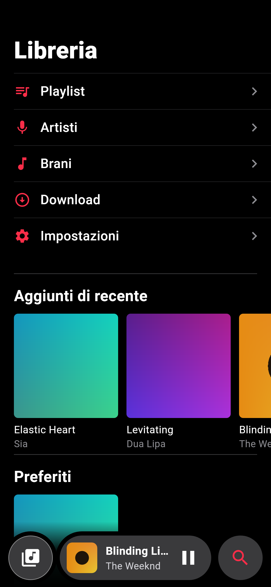

# mp4PcPlayer

Un player musicale personale in stile Apple Music, fatto per telefono e computer con un'unica app.
La musica la scarichi tu da YouTube, resta sul tuo dispositivo e si ascolta anche offline.

## ⬇️ Scarica

| | |
|---|---|
| **Windows** | [mp4Player-windows-setup.exe](https://github.com/nico10469/mp4PcPlayer/releases/latest/download/mp4Player-windows-setup.exe): app + server di download |
| **Android** | [mp4Player-android.apk](https://github.com/nico10469/mp4PcPlayer/releases/latest/download/mp4Player-android.apk) |

Tutte le versioni sono nella pagina [Releases](https://github.com/nico10469/mp4PcPlayer/releases).

| Telefono | | |
|---|---|---|
|  |  |  |

_Le copertine negli screenshot sono segnaposto generati per la demo._

## Come funziona

```
  App (Flutter)                          Server (Python)
  Windows, macOS, Linux,   ── cerca ──▶  FastAPI + yt-dlp
  Android, iPhone          ◀─ file m4a ─  scarica da YouTube
     │
     └─ salva il brano in locale e lo riproduce (anche offline)
```

- **`app/`**: l'app Flutter, un solo codice per tutte le piattaforme. In basso ci sono tre pulsanti: la Libreria a sinistra (Playlist, Artisti, Brani, Download, Impostazioni, poi gli aggiunti di recente e le playlist), il brano in riproduzione al centro e la ricerca a destra. Il player a schermo intero prende il colore della copertina e dai tre puntini mostra i metadati del brano (artista, album, genere, anno...), che si possono anche correggere.
- **`server/`**: un piccolo server Python che usa yt-dlp. Cerca su YouTube, scarica l'audio e lo passa all'app. Tienilo acceso su un PC, su un Raspberry Pi o su un VPS.

L'audio viene salvato in **m4a (AAC)**, che si riproduce ovunque, iPhone compreso. Se sul server c'è `ffmpeg`, yt-dlp converte in m4a anche i video che su YouTube hanno solo audio opus.

## Installare (il modo semplice)

Dai link qui sopra (o dalla pagina [Releases](https://github.com/nico10469/mp4PcPlayer/releases)) scarichi:

- **`mp4Player-windows-setup.exe`**: l'installer per Windows, con l'app e, se lo lasci spuntato, anche il **server di download**. Non serve installare Python. L'installer apre la porta 8000 nel firewall solo per le reti private (casa), così il telefono raggiunge il server. Può anche avviare il server all'accensione del PC.
- **`mp4Player-android.apk`**: l'app per Android. Aprilo dal telefono e consenti "Installa app sconosciute" quando Android lo chiede. Poi, in Libreria > Impostazioni, scrivi l'indirizzo che la finestra del server mostra sul PC.

Gli installer li crea la GitHub Action **Installer** (`.github/workflows/installer.yml`):

- **nuova versione da scaricare:** tab *Actions > Installer > Run workflow*, scrivi la versione (es. `1.0.0`) e premi *Run workflow*. Viene creata la Release `v1.0.0` con i due file, e i link qui sopra puntano subito a quella;
- in alternativa, un tag: `git tag v1.0.0 && git push origin v1.0.0`;
- *Run workflow* senza versione fa solo la build (file negli *Artifacts* del run).

**Firma Android.** Android aggiorna un'app solo se la nuova versione è firmata con la stessa chiave. Crea la chiave una volta sola:

```bash
keytool -genkeypair -v -keystore release.jks -alias mp4player -keyalg RSA -keysize 2048 -validity 10000
base64 -w0 release.jks   # su Windows: certutil -encode release.jks out.txt
```

Poi, nel repository su GitHub, vai in *Settings > Secrets and variables > Actions* e aggiungi `ANDROID_KEYSTORE_BASE64` (il testo base64) e `ANDROID_KEYSTORE_PASSWORD` (la password). Conserva `release.jks`: se la perdi, per aggiornare dovrai disinstallare l'app. Senza questi secrets l'APK funziona lo stesso, ma ogni nuova versione va installata dopo aver disinstallato la precedente.

## 1. Avviare il server

Su Windows il server è già incluso nell'installer. Negli altri casi serve Python 3.10 o più recente.

```bash
cd server
python -m venv .venv
source .venv/bin/activate          # su Windows: .venv\Scripts\activate
pip install -r requirements.txt
python run_server.py          # mostra anche l'indirizzo da scrivere nell'app
```

Variabili facoltative:

| Variabile | A cosa serve | Predefinito |
|---|---|---|
| `MP4_LIBRARY` | cartella dove il server salva i file | `library` |
| `MP4_TOKEN` | se impostata, l'app deve usare questo token | nessuno |

Se il server è raggiungibile da internet, **imposta sempre `MP4_TOKEN`**. Per usarlo fuori casa senza aprire porte sul router, la soluzione più semplice è [Tailscale](https://tailscale.com): lo installi sul server e sul telefono e usi l'indirizzo Tailscale del server.

Quando YouTube cambia qualcosa e i download smettono di funzionare, basta aggiornare yt-dlp sul server con `pip install -U yt-dlp`, senza toccare l'app.

API principali: `GET /search?q=`, `POST /downloads {"source": id o link}`, `GET /downloads/{job}`, `GET /tracks`, `GET /tracks/{id}/file`. La documentazione interattiva è su `http://server:8000/docs`.

## 2. Avviare l'app

Installa [Flutter](https://docs.flutter.dev/get-started/install), poi:

```bash
cd app
flutter pub get
flutter run -d windows     # oppure macos, linux, oppure un telefono collegato
```

Al primo avvio vai in **Libreria > Impostazioni**, scrivi l'indirizzo del server (es. `http://192.168.1.10:8000`) e premi "Salva e prova la connessione". Su PC l'indirizzo predefinito è già `http://127.0.0.1:8000`, cioè il server sullo stesso computer.

Per creare l'app installabile:

| Piattaforma | Comando | Note |
|---|---|---|
| Android | `flutter build apk` | installi l'APK direttamente sul telefono |
| Windows | `flutter build windows` | serve Visual Studio con "Sviluppo desktop C++" |
| macOS | `flutter build macos` | serve un Mac con Xcode |
| iPhone | `flutter build ios` | serve un Mac con Xcode, vedi sotto |
| Linux | `flutter build linux` | servono `libgtk-3-dev` e `libmpv-dev` |

**iPhone:** un'app che scarica da YouTube non viene accettata sull'App Store, quindi va installata in sideload. Puoi usare Xcode con il tuo Apple ID (va reinstallata ogni 7 giorni), AltStore/SideStore, oppure un account sviluppatore (99 €/anno, dura un anno).

## Test

```bash
cd server && pip install -r requirements-dev.txt && pytest
cd app && flutter analyze && flutter test
```

## Cose da sapere

- Scaricare da YouTube va contro i suoi termini di servizio. Il progetto è pensato per un uso personale.
- La riproduzione in background con i controlli nella schermata di blocco non c'è ancora: è il prossimo passo (`just_audio_background` / `audio_service`).
