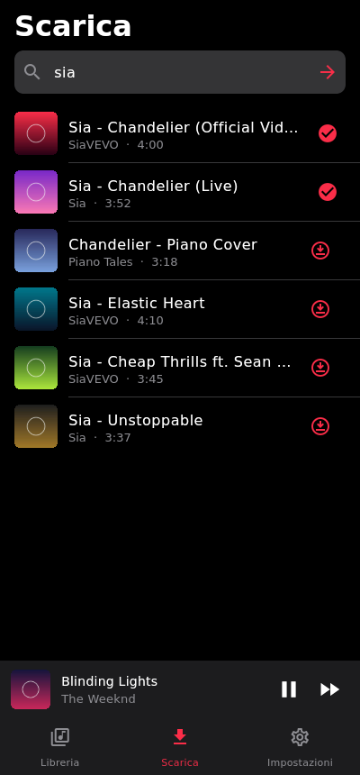
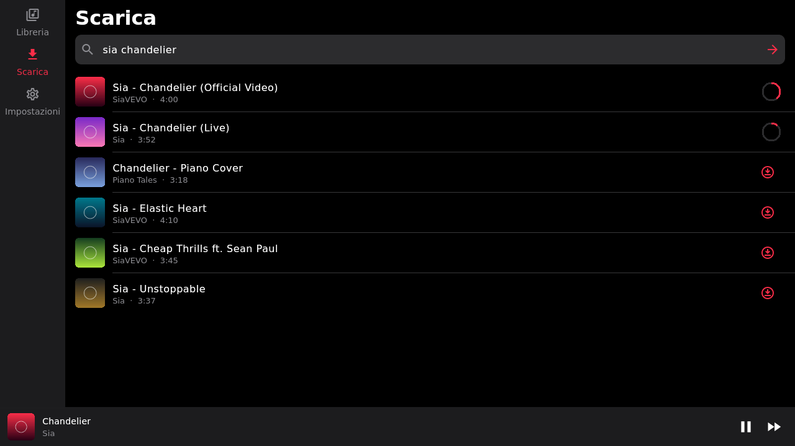

# mp4PcPlayer

Un player musicale personale in stile Apple Music, fatto per telefono e computer con un'unica app.
La musica la scarichi tu da YouTube, resta sul tuo dispositivo e si ascolta anche offline.

| Telefono | | |
|---|---|---|
|  |  |  |



_Le copertine negli screenshot sono segnaposto generati per la demo._

## Come funziona

```
  App (Flutter)                          Server (Python)
  Windows, macOS, Linux,   ── cerca ──▶  FastAPI + yt-dlp
  Android, iPhone          ◀─ file m4a ─  scarica da YouTube
     │
     └─ salva il brano in locale e lo riproduce (anche offline)
```

- **`app/`**: l'app Flutter, un solo codice per tutte le piattaforme. Ha tre sezioni: Libreria, Scarica e Impostazioni, più il mini player e la schermata "In riproduzione". Sul telefono la barra è in basso, su PC di lato.
- **`server/`**: un piccolo server Python che usa yt-dlp. Cerca su YouTube, scarica l'audio e lo passa all'app. Tienilo acceso su un PC, su un Raspberry Pi o su un VPS.

L'audio viene salvato in **m4a (AAC)**, che si riproduce ovunque, iPhone compreso. Se sul server c'è `ffmpeg`, yt-dlp converte in m4a anche i video che su YouTube hanno solo audio opus.

## 1. Avviare il server

Serve Python 3.10 o più recente.

```bash
cd server
python -m venv .venv
source .venv/bin/activate          # su Windows: .venv\Scripts\activate
pip install -r requirements.txt
uvicorn mp4server.main:app --host 0.0.0.0 --port 8000
```

Variabili facoltative:

| Variabile | A cosa serve | Predefinito |
|---|---|---|
| `MP4_LIBRARY` | cartella dove il server salva i file | `library` |
| `MP4_TOKEN` | se impostata, l'app deve usare questo token | nessuno |

Se il server è raggiungibile da internet, **imposta sempre `MP4_TOKEN`**. Per usarlo fuori casa senza aprire porte sul router, la soluzione più semplice è [Tailscale](https://tailscale.com): lo installi sul server e sul telefono e usi l'indirizzo Tailscale del server.

Quando YouTube cambia qualcosa e i download smettono di funzionare, basta aggiornare yt-dlp sul server con `pip install -U yt-dlp`, senza toccare l'app.

API principali: `GET /search?q=`, `POST /downloads {"source": id o link}`, `GET /downloads/{job}`, `GET /tracks`, `GET /tracks/{id}/file`. La documentazione interattiva è su `http://server:8000/docs`.

## 2. Avviare l'app

Installa [Flutter](https://docs.flutter.dev/get-started/install), poi:

```bash
cd app
flutter pub get
flutter run -d windows     # oppure macos, linux, oppure un telefono collegato
```

Al primo avvio vai in **Impostazioni**, scrivi l'indirizzo del server (es. `http://192.168.1.10:8000`) e premi "Salva e prova la connessione".

Per creare l'app installabile:

| Piattaforma | Comando | Note |
|---|---|---|
| Android | `flutter build apk` | installi l'APK direttamente sul telefono |
| Windows | `flutter build windows` | serve Visual Studio con "Sviluppo desktop C++" |
| macOS | `flutter build macos` | serve un Mac con Xcode |
| iPhone | `flutter build ios` | serve un Mac con Xcode, vedi sotto |
| Linux | `flutter build linux` | servono `libgtk-3-dev` e `libmpv-dev` |

**iPhone:** un'app che scarica da YouTube non viene accettata sull'App Store, quindi va installata in sideload. Puoi usare Xcode con il tuo Apple ID (va reinstallata ogni 7 giorni), AltStore/SideStore, oppure un account sviluppatore (99 €/anno, dura un anno).

## Test

```bash
cd server && pip install -r requirements-dev.txt && pytest
cd app && flutter analyze && flutter test
```

## Cose da sapere

- Scaricare da YouTube va contro i suoi termini di servizio. Il progetto è pensato per un uso personale.
- La riproduzione in background con i controlli nella schermata di blocco non c'è ancora: è il prossimo passo (`just_audio_background` / `audio_service`).
