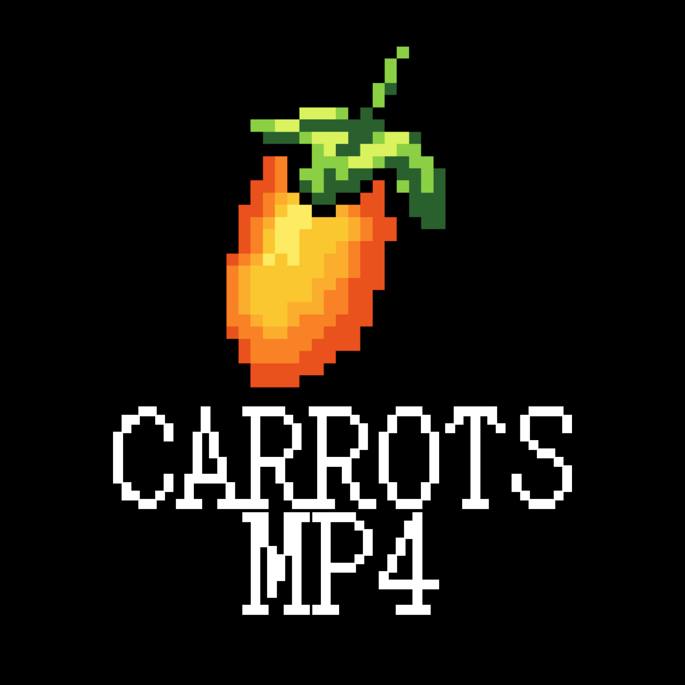
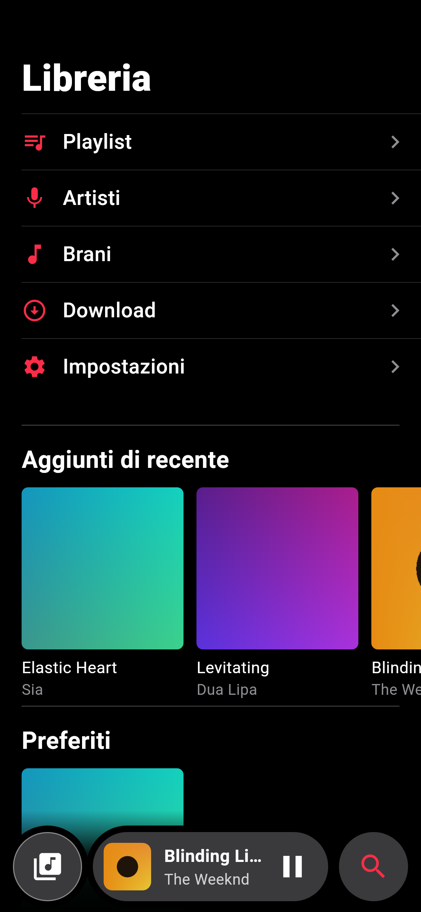
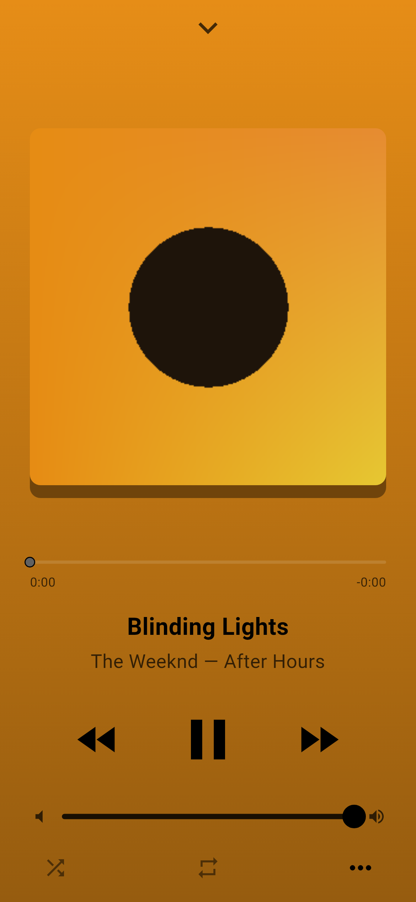
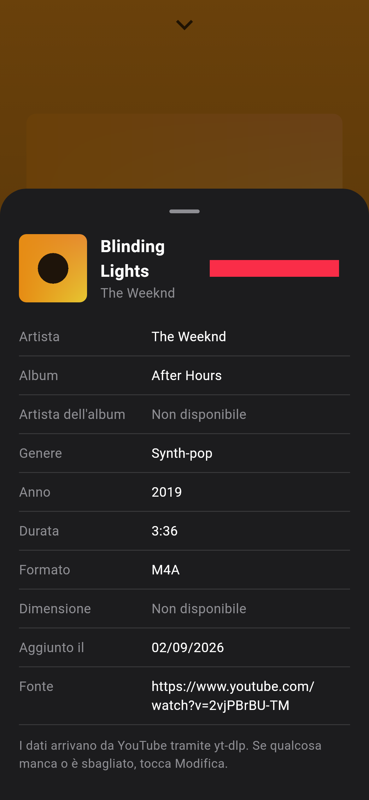

<p align="center"></p>

# Carrots MP4

A personal music player in the style of Apple Music, with one app for both phone and computer (this repository is still called mp4PcPlayer).
You download the music yourself from YouTube. It stays on your device and plays offline too.

## ⬇️ Download

| | |
|---|---|
| **Windows** | [mp4Player-windows-setup.exe](https://github.com/nico10469/mp4PcPlayer/releases/latest/download/mp4Player-windows-setup.exe): app + download server |
| **Android** | [mp4Player-android.apk](https://github.com/nico10469/mp4PcPlayer/releases/latest/download/mp4Player-android.apk) |

Every version is on the [Releases](https://github.com/nico10469/mp4PcPlayer/releases) page.

| Library | Now playing | Track info |
|---|---|---|
|  |  |  |

_The covers in the screenshots are placeholders generated for the demo. The app interface is in Italian._

## Features

- **Bottom bar:** the library button on the left, the song that is playing in the middle (cover, title, artist, play/pause) and search on the right.
- **Library:** Playlists, Artists, Songs, Download and Settings. Below them are the recently added songs, your favorites and your playlists.
- **Playlists:** you can create a playlist with its own cover image, description and songs, sort your playlists and search them. Each song has a menu with remove from playlist, delete, add to playlist, play next, show artist, favorite and track info.
- **Artists:** every artist in your library. Songs downloaded from v0.4.0 keep only the main artists and the featured guests (no producers or writers), and a song with a guest shows up under both. An artist's page shows the 5 songs you play most, with how many times you played them, then all of the artist's albums and singles from YouTube Music (the ones you already have say "In libreria"; the others open to be downloaded). Offline it shows the albums in your library.
- **Search:** it searches your library as you type. Press Enter to search YouTube too and download from the results.
- **Player:** the full-screen player takes the dominant color of the cover. Tap an artist's name under the title to open their page. The heart adds the song to your Favorites, and the "…" button shows the track's metadata (artist, album, genre, year, duration, format, source).
- **Edit metadata:** in the track info, "Modifica" lets you change the cover (pick any image), title, artist, album, album artist, genre, year and lyrics.
- **Lyrics:** the track info shows the lyrics in their original language. They come from the file's tags when present, otherwise from [LRCLIB](https://lrclib.net), a free lyrics archive, and are saved with the song.
- **Favorites:** the songs you like go in a special "Preferiti" folder with a purple heart on a lilac background, next to your playlists. The files are not duplicated.
- **Your music folder:** in Settings you can choose the folder where your songs are saved (on Android the app asks for "All files access" first). Your existing songs are moved there with readable names (`Artist - Title.m4a`), and any audio files already in that folder (mp3, m4a, flac, ogg...) are added to the library with their tags and covers. On iPhone the songs go in the app's folder, visible in the Files app.
- **Download without a server:** on Android and iPhone the app searches YouTube Music and downloads the audio by itself, with no server (Settings > Download > "Nell'app"). On a PC the default is the server, which you can still pick on the phone too.
- **Download:** it searches YouTube Music, so it shows the official audio tracks (just the album cover, no video) first. The Albums and Playlists tabs let you download a whole album or playlist in one tap; a downloaded playlist also becomes a playlist in the app. You can paste a YouTube or YouTube Music link to a song, an album or a playlist.

## How it works

There are two ways to download, chosen in Settings:

- **In the app** (default on Android and iPhone): the app talks to YouTube Music directly. On Android it downloads with the real [yt-dlp](https://github.com/yt-dlp/yt-dlp), bundled through [youtubedl-android](https://github.com/JunkFood02/youtubedl-android) (Python and QuickJS included, which is why the APK is bigger); Settings > "Aggiorna motore download" updates yt-dlp without a new app version. On iPhone and on the computer the app downloads the audio itself, asking YouTube for an audio-only link with the same client yt-dlp uses (the Quest VR app) and fetching it in 10 MB pieces; [youtube_explode_dart](https://pub.dev/packages/youtube_explode_dart) is the fallback. Nothing else to install. When YouTube changes something, downloads may stop until a new version of the app comes out.
- **With the server** (default on PC):

```
  App (Flutter)                              Server (Python)
  Windows, macOS, Linux,   ── search ──▶     FastAPI + yt-dlp
  Android, iPhone          ◀─ m4a file ──    downloads from YouTube
     │
     └─ saves the song locally and plays it (offline too)
```

- **`app/`**: the Flutter app, with one codebase for every platform.
- **`server/`**: a small Python server that uses yt-dlp and [ytmusicapi](https://github.com/sigma67/ytmusicapi). It searches YouTube Music, downloads the audio with its metadata (title, artist, album, genre, year) and hands it to the app. Keep it running on a PC, a Raspberry Pi or a VPS.

Audio is saved as **m4a (AAC)**, which plays everywhere, iPhone included. If `ffmpeg` is installed on the server, yt-dlp also converts to m4a the videos that only have opus audio on YouTube, and writes the metadata into the file's tags.

## Installing (the easy way)

From the links above (or the [Releases](https://github.com/nico10469/mp4PcPlayer/releases) page) you can download:

- **`mp4Player-windows-setup.exe`**: the Windows installer. It installs the app and, if you leave its box ticked, the **download server** too. You don't need to install Python. The installer opens port 8000 in the firewall for private (home) networks only, so your phone can reach the server. It can also start the server when the PC starts.
- **`mp4Player-android.apk`**: the Android app. Open it on your phone and allow "Install unknown apps" when Android asks. It downloads music by itself; if you prefer the PC server, go to Library > Settings, pick "Con il server" and type the address that the server window shows on the PC.

The installers are built by the **Installer** GitHub Action (`.github/workflows/installer.yml`):

- **to publish a new version:** go to *Actions > Installer > Run workflow*, type the version (e.g. `1.0.0`) and press *Run workflow*. This creates the `v1.0.0` Release with both files, and the links above point to it right away;
- alternatively, push a tag: `git tag v1.0.0 && git push origin v1.0.0`;
- *Run workflow* without a version only builds (the files are in the run's *Artifacts*).

**Android signing.** Android only updates an app when the new version is signed with the same key. Create the key once:

```bash
keytool -genkeypair -v -keystore release.jks -alias mp4player -keyalg RSA -keysize 2048 -validity 10000
base64 -w0 release.jks   # on Windows: certutil -encode release.jks out.txt
```

Then, in the GitHub repository, go to *Settings > Secrets and variables > Actions* and add `ANDROID_KEYSTORE_BASE64` (the base64 text) and `ANDROID_KEYSTORE_PASSWORD` (the password). Keep `release.jks` safe: if you lose it, you will have to uninstall the app to update it. Without these secrets the APK still works, but you have to uninstall the previous version before installing a new one.

## 1. Starting the server

On Windows the server is already included in the installer. Everywhere else you need Python 3.10 or newer.

```bash
cd server
python -m venv .venv
source .venv/bin/activate          # on Windows: .venv\Scripts\activate
pip install -r requirements.txt
python run_server.py          # also shows the address to type in the app
```

Optional variables:

| Variable | What it does | Default |
|---|---|---|
| `MP4_LIBRARY` | folder where the server saves the files | `library` |
| `MP4_TOKEN` | if set, the app must use this token | none |

If the server can be reached from the internet, **always set `MP4_TOKEN`**. The simplest way to use it away from home without opening ports on your router is [Tailscale](https://tailscale.com): install it on the server and on your phone, and use the server's Tailscale address.

When YouTube changes something and downloads or searches stop working, update the server's libraries with `pip install -U yt-dlp ytmusicapi`. The app doesn't need to change.

Main API: `GET /search?q=&kind=songs|albums|playlists`, `GET /collection?source=` (the songs of an album or playlist), `GET /artist?name=` (an artist's albums and singles), `POST /downloads {"source": id or link}`, `GET /downloads/{job}`, `GET /tracks`, `GET /tracks/{id}/file`. The interactive documentation is at `http://server:8000/docs`.

## 2. Starting the app

Install [Flutter](https://docs.flutter.dev/get-started/install), then:

```bash
cd app
flutter pub get
flutter run -d windows     # or macos, linux, or a connected phone
```

On a phone you can download right away. To use the server instead, go to **Library > Settings**, pick "Con il server", type the server address (e.g. `http://192.168.1.10:8000`) and press "Salva e prova la connessione" (save and test the connection). On a PC the default address is already `http://127.0.0.1:8000`, that is, the server on the same computer.

To build an installable app:

| Platform | Command | Notes |
|---|---|---|
| Android | `flutter build apk` | install the APK directly on the phone |
| Windows | `flutter build windows` | needs Visual Studio with "Desktop development with C++" |
| macOS | `flutter build macos` | needs a Mac with Xcode |
| iPhone | `flutter build ios` | needs a Mac with Xcode, see below |
| Linux | `flutter build linux` | needs `libgtk-3-dev` and `libmpv-dev` |

**iPhone:** the App Store doesn't accept an app that downloads from YouTube, so it has to be sideloaded. You can use Xcode with your Apple ID (it has to be reinstalled every 7 days), AltStore/SideStore, or a developer account (€99 a year, lasts a year).

## Tests

```bash
cd server && pip install -r requirements-dev.txt && pytest
cd app && flutter analyze && flutter test
```

## Good to know

- Downloading from YouTube is against its terms of service. This project is meant for personal use.
- Background playback with lock-screen controls isn't there yet. It is the next step (`just_audio_background` / `audio_service`).
